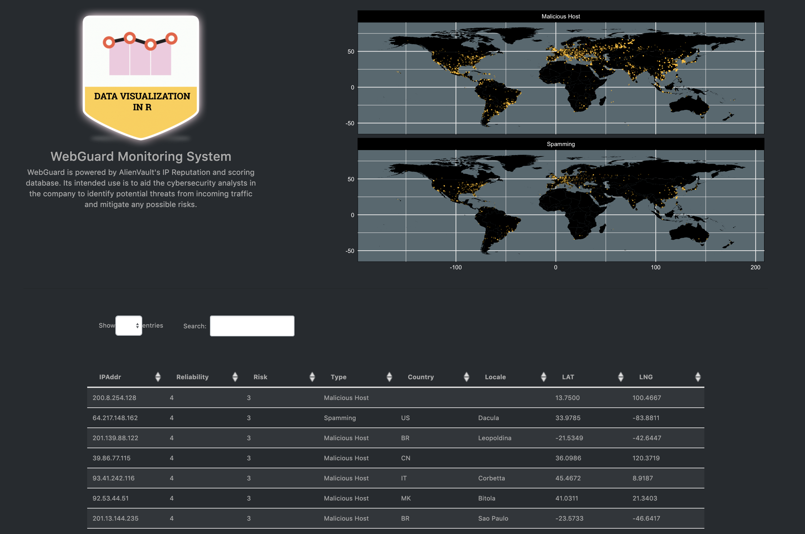

# DarkerShiny

## Description

An out-of-the-box Shiny app template that we'll use to walk through the hypothetical example of a cybersecurity company. The components are:

- Shiny web app framework  
- `ggplot2` visualization toolkit  
- `maps` package for geo-visualization tool  
- `dplyr` and other members of the `tidyverse` family  
- [Bootstrap 4](https://getbootstrap.com/)
- HTML and CSS  

This serves as some boilerplate code we will use for the code-along session. It's a starting point that you can take and flesh it out into a minimal [Intrusion Detection System](https://en.wikipedia.org/wiki/Intrusion_detection_system). Throughout the session we'll be adding some extra web framework components, visualization components and walk through the best practice of integration HTML, CSS, and JavaScript into a Shiny project (for R developers) or Flask project (Python developers). 

## Installation and Usage

#### Method 1: Fork to your own repo (Recommended)
1. Forking it and then using `git clone`.  
- Example: `git clone https://github.com/onlyphantom/darkershiny.git`
2. Run `app.R`

#### Method 2: Download and Run
1. Download the repo from [this repo](https://github.com/onlyphantom/darkershiny). 
2. Run `app.R`

The dependencies are automatically installed if R doesn't detect them. After installation, it is recommended that you stay connected to the internet while running `app.R` for the first time. R packages are installed on your computer so you will not need to have an active internet connection after this. 

## Workshop Notes
The code and its asset can be used to follow along the code-along session of Algoritma's Kickstart Series: Gentle introduction to Developing Web Apps in R & Python.

1. The `supreme` folder contains the Flask template that we created together in the final 30 mins of the class. Make sure you've installed Flask in the virtual environment (`conda env` or `pip env`) as per the in-classroom instructions
2. `plan_bandung.md` is the lecture plan and notes used for the Bandung session on 16/2/19 
3. `plan_jakarta.md` is the lecture plan and notes used for the Jakarta session on 23/2/19

#### Bandung Session
- Date: Saturday, **February 16th** 2019  
- Time: 1300 - 1600  
- Venue: Innovation Factory, Bandung  
- Lead Instructor: [Samuel Chan](https://id.linkedin.com/in/chansamuel)  

#### Jakarta Session
- Date: Saturday, **February 23rd** 2019  
- Time: 1300 - 1600  
- Venue: Innovation Factory, Jakarta  
- Lead Instructor: [Samuel Chan](https://id.linkedin.com/in/chansamuel)  

### Syllabus

The workshop aims to provide a beginner-friendly introduction to packaging your data science work into a user-friendly, modernly-themed web analytics application.

Corporate consultant and course producer Samuel Chan has worked for a number of public-listed company prior to his role at Algoritma. His involvement has always heavily centered around product development, from building chatbots for companies to developing cloud-based products. In this workshop, he will walk us through his favorite tools, workflow, and productivity tips:

- Recommendations on productionizing R code  
- The Shiny framework for data scientists  
- Using Python's web frameworks for application development  
- TensorFlow as a web service  
- Cloud deployment options for R- or Python-based applications  
- Production concerns: security, uptime, and continuous integration  
- Productivity tools for real-life data science: Git, IDE extensions, Virtual Environments vs Docker  

--- 
## Credits
The dataset is sampled from AlienVault's [IP Reputation database](http://reputation.alienvault.com/ reputation.data) for educational purpose. AlienVault, Inc. is a developer of commercial and open source solutions to manage cyber attacks, including the Open Threat Exchange, the world's largest crowd-sourced computer-security platform.

The assets (badge, images and other intellectual property) is taken from [Algoritma Data Science Education Center](https://algorit.ma) with permission. 

The work is sponsored by:
- BLOCK71's Innovation Factory  
- Algoritma, a data science education center on a mission to democratize world-class education, helping professionals to gain proficiency in machine learning and data visualization by building with real-world projects.

## Screenshot

